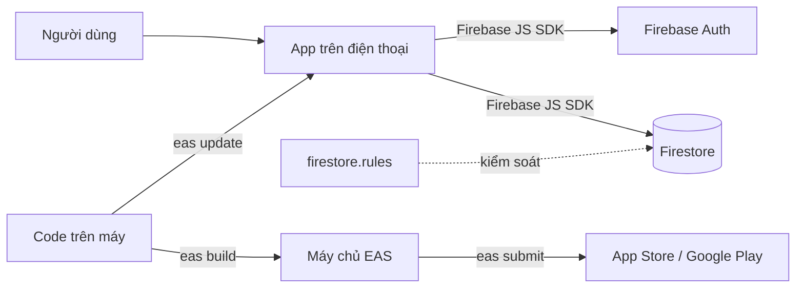

# Mobile Expo + Firebase

## Dùng khi nào
Cần **app thật trên App Store / Google Play**, hoặc cần tính năng máy: camera, thông báo đẩy, chạy offline...
Nếu chỉ cần "dùng như app trên điện thoại" → dùng [`web-nextjs-firebase`](../web-nextjs-firebase/) (PWA), đơn giản và miễn phí hơn.

## Thành phần
| Thành phần | Công nghệ | Vai trò |
|------------|-----------|---------|
| App        | Expo (React Native) + TypeScript | Không giữ thư mục native trong repo — Expo tự sinh khi build |
| Điều hướng | Expo Router | Màn hình theo file trong `src/app/` (giống Next.js) |
| Database   | Cloud Firestore (Firebase JS SDK) | Lưu dữ liệu; bảo mật bằng `firestore.rules` |
| Đăng nhập  | Firebase Auth (Firebase JS SDK) | Email/Google; lưu phiên đăng nhập bằng AsyncStorage |
| Chạy thử   | App **Expo Go** trên điện thoại | Quét mã QR là chạy, không cần Android Studio / Xcode |
| Build & phát hành | **EAS Build + EAS Submit** | Build trên máy chủ Expo (iOS không cần Mac), tự giữ khoá ký app, đẩy lên store |
| Cập nhật nhanh | EAS Update | Sửa phần JavaScript → gửi tới người dùng không cần store duyệt lại |
| Kiểm thử   | Jest (`jest-expo`) + Firebase Emulator | `npm run check` |

## Sơ đồ

## Chi phí & giới hạn
- Firebase: **gói Spark miễn phí** như web.
- **Expo / EAS**: có gói miễn phí, **giới hạn số lần build mỗi tháng** và xếp hàng chậm hơn; cần nhiều hơn thì trả phí. Kiểm tra bảng giá hiện tại tại https://expo.dev/pricing trước khi báo người dùng.
- **Tài khoản store** (chỉ khi phát hành): Apple Developer **$99/năm**, Google Play **$25 một lần**.
- Chạy thử bằng Expo Go: **0đ**.

## Môi trường
Nhẹ — gần như giống web:
- Node.js và Java 21+ cho Firebase Emulator (đã có từ gói `web`).
- App **Expo Go** trên điện thoại (tải từ App Store / Google Play).
- Tài khoản **Expo** (expo.dev) — để build và phát hành.
- Skill `thiet-lap-moi-truong` cần thêm gói `mobile` (**chưa làm**): Expo Go, tài khoản Expo, `eas login`.

## Khi nào KHÔNG nên dùng
- Không cần store / tính năng máy → dùng web (PWA).
- Cần thư viện native mà Expo Go không có → vẫn dùng được kiến trúc này, nhưng phải chuyển sang **development build** (xem `rules.md`, mục X3) — chạy thử chậm hơn, không còn quét-QR-chạy-ngay.

## Rules
- Chung: [`../_chung/clean-rules.md`](../_chung/clean-rules.md)
- Riêng: [`rules.md`](rules.md)
