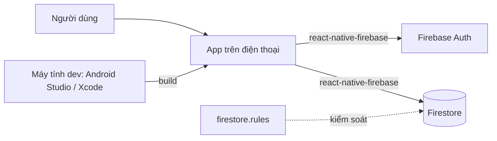

# Mobile React Native (bare) + Firebase

## Dùng khi nào
Cần **app thật trên App Store / Google Play**, hoặc cần tính năng máy: camera, thông báo đẩy, chạy offline, Bluetooth...
Nếu chỉ cần "dùng như app trên điện thoại" → dùng [`web-nextjs-firebase`](../web-nextjs-firebase/) (PWA), đơn giản và miễn phí hơn nhiều.

## Thành phần
| Thành phần | Công nghệ | Vai trò |
|------------|-----------|---------|
| App        | React Native (bare, không Expo) + TypeScript | Có thư mục native `android/`, `ios/` |
| Điều hướng | React Navigation | Các màn hình trong `src/app/` |
| Database   | Cloud Firestore (`@react-native-firebase/firestore`) | Lưu dữ liệu; bảo mật bằng `firestore.rules` |
| Đăng nhập  | Firebase Auth (`@react-native-firebase/auth`) | Email/Google |
| Kiểm thử   | Jest + Firebase Emulator | `npm run check` |
| Phát hành  | App Store Connect, Google Play Console | Đưa app lên store |

## Sơ đồ

## Chi phí & giới hạn
- Firebase: **gói Spark miễn phí** như web.
- **Đưa lên store**: Apple Developer **$99/năm**, Google Play **$25 một lần**. Chỉ cần khi phát hành; chạy thử trên máy mình thì không cần.
- **iOS chỉ build được trên Mac.** Máy Windows chỉ làm được Android.

## Môi trường — nặng hơn web nhiều
Cần thêm (skill `thiet-lap-moi-truong`, gói `mobile` — **chưa làm**):
- **Android**: JDK 17, Android Studio + Android SDK + máy ảo (emulator), biến `ANDROID_HOME`. Vài GB.
- **iOS (chỉ Mac)**: Xcode (~15 GB, tải từ App Store), CocoaPods, Watchman.
- Mỗi lần thay đổi phần native (thêm thư viện có code native) phải **build lại app** (vài phút), không có quét-QR-chạy-ngay như Expo Go.

## Khi nào KHÔNG nên dùng
- Không cần store / tính năng máy → dùng web (PWA).
- Người dùng chỉ có máy Windows nhưng cần iOS → không làm được tại máy; cần Mac hoặc dịch vụ build trên mạng.
- Người dùng không chấp nhận cài vài chục GB công cụ → cân nhắc lại.

## Rules
- Chung: [`../_chung/clean-rules.md`](../_chung/clean-rules.md)
- Riêng: [`rules.md`](rules.md)
