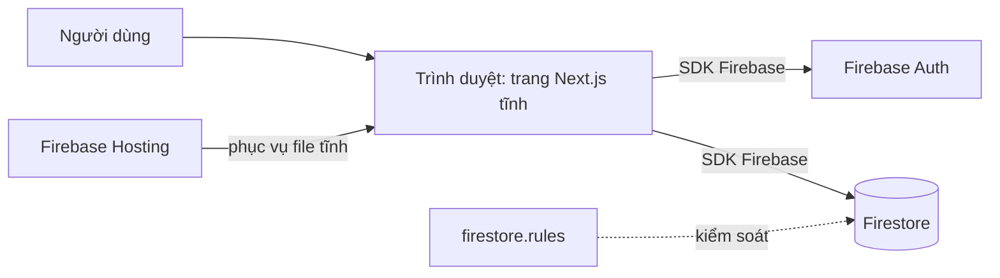

# Web Next.js + Firebase

## Dùng khi nào
Web app có đăng nhập và lưu dữ liệu: đặt lịch, quản lý danh sách, form, trang cá nhân, cửa hàng nhỏ, tool nội bộ.
Người dùng có thể **thêm vào màn hình chính điện thoại** (PWA) để dùng như app — không cần App Store.

## Thành phần
| Thành phần | Công nghệ | Vai trò |
|------------|-----------|---------|
| Giao diện  | Next.js (App Router) + React + TypeScript | Các trang web, **xuất tĩnh** (`output: 'export'`) |
| Backend    | Không có máy chủ riêng | Trình duyệt gọi thẳng Firebase |
| Database   | Cloud Firestore | Lưu dữ liệu; bảo mật bằng `firestore.rules` |
| Đăng nhập  | Firebase Authentication | Email/Google |
| Hosting    | Firebase Hosting | Phục vụ thư mục `out/` |
| Kiểm thử   | Vitest + Firebase Emulator | `npm run check` |

## Sơ đồ

## Chi phí & giới hạn
- **Gói Spark — miễn phí, không cần thẻ.** Đủ cho học và app nhỏ (giới hạn lượt đọc/ghi Firestore mỗi ngày, dung lượng hosting).
- **Không có code chạy trên máy chủ**: không Server Actions, không API routes, không render động theo request. Trang động lấy dữ liệu phía trình duyệt.

## Khi nào KHÔNG nên dùng
- Cần giữ **bí mật trên máy chủ**: thanh toán, gọi API có key trả phí, gửi email tự động → cần Firebase App Hosting hoặc Cloud Functions (**gói Blaze, cần thẻ**). Chuyển lên khi thật cần; `domain/` và `services/` giữ nguyên, chủ yếu đổi `data/` và cấu hình deploy.
- Cần **lên App Store / Google Play** hoặc dùng sâu tính năng máy → dùng [`mobile-expo-firebase`](../mobile-expo-firebase/).
- Chỉ là 1 trang giới thiệu tĩnh, không dữ liệu → kiến trúc này thừa.

## Rules
- Chung: [`../_chung/clean-rules.md`](../_chung/clean-rules.md)
- Riêng: [`rules.md`](rules.md)

## Khung dự án
[`khung-du-an/`](khung-du-an/) — **chưa làm**.
